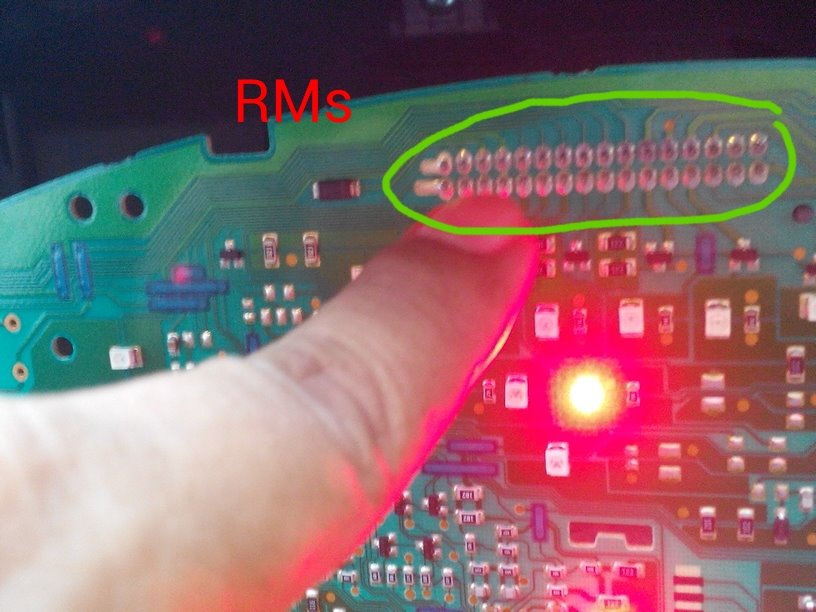

Perawatan Elektrik
Perkabelan, lampu dan AC Proton savvy

Starter dan Alarm
RM S : Ceritaku bersama savvy kecil. Diawali dengan Savvyku ada masalah stater bisa, namun kadang mesin mau hidup, dan terkadang tidak mau hidup. Dan kapan bisa hidup saat stater.. itu tidak bisa diprediksi. Terkadang stater langsung jreng hidup..dipakai jalan dan masuk garasi kembali...besoknya distater sdh tdk mau hidup lagi. Berkali kali kejadian spt ini. Banyak hal sdh dicek.. Dari CKP, ECT, dll. Pada saat kambuh tdk mau stater, pompa bensin tdk hidup, dan api di busi tdk keluar. Cek voltase aki...bagus...13,8 volt. Pada saat tdk mau hidup, solusi sementara di reset ecu beberapa menit. Trus dinyalakan lagi..baru bisa. Namun ini bukan mengobati penyakitnya, hanya mengurangi rasa sakit sementara saja. Besoknya akan kambuh lagi. Pada suatu saat...savvy ngambeg lagi, dan di cek oleh kawan. Pompa gak hidup, api busi gak ada. Cek sana sini, akhirnya ada secercah petunjuk. Bahwa massa di relay pompa tidak ada. Artinya adalah, pompa bensin belum tentu rusak, tapi karena massa tidak ada, jadi relay gak main. Akhirnya di kejut dng melepas socket ecu dan memasangnya lagi..dan masa baru bisa masuk. Prediksi mengarah ke ECU bermasalah. Tapi sementara sembuh. Selang beberapa hari.....savvy ngambeg lagi. Saya baca baca di internet, dan tertarik untuk coba trik yg saya dpt dari google, yaitu pada saat savvy gak mau hidup, coba di lock dan unlock dng remote..posisi dari dalam kabin dng semua pintu tertutup.. Amazing...hal ini ternyata bisa membantu. Stater...savvy mau hidup. Namun terkadang masih tdk mau hidup. Dan saya akali dng trick lock dan unlock tsb. Selalu saya akali begitu jika savvy susah hidup..dan selalu sukses. Akhirnya atas saran rekan....socket alarm saya coba lepas. Dan apa yg terjadi... Sampai saat ini...penyakit susah hidup saat stater....hilang. Begitu stater langsung jreng. Hanya sekarang alarm tdk aktif. Kunci pintu secara manual. Namun saya senang...penyakit utama sdh sembuh. Pelajaran ini...mungkin bisa berguna bagi rekan yg mengalami hal yg sama dng saya. Salam...savvy.

Teddy Hermansyah saya pernah ngalamin juga. sampe putus asa. akhirnya kabel buat sambung ke ecu di tambahin solder. Alhamdulillah smp sekarang no problem

RM S : Awalnya tdk percaya, kalau panel meter ada hubungan dng cut off ecu. Tapi kenyataannya demikian adanya. Silahkan cek posisi tsb, bagi yg mengalami problem serupa, dng catatan fuel pump ok, coil ok, Accu ok... Sebelum mengganti ecu, cek dulu pcb speedo meternya. Ada crack, shg cross contact.

Reset Alarm
Darussalam Saleh Sip : Tekan aga lama tombol yg diseblh hazat. Tekan aga lama.

Reset Ulang
Ahmad Sarif Di reset ulang aja om.kunci kontak di on- off 5x.sampai tombol lambang titik diatas audio berkedip.lalu tekan tombol lock/ unlock di kunci sampai tombol titiknya tidak berkedip.setelah itu tekan tombol sirine di kunci sampai tombol titik kembali berkedip.cabut kunci.selesai deh....

Air Conditioner
Belmeier Raymond :

AC gw brmasalah dengan gak ada bunyi 'cetek' pdhal mesin ud naik tp gk nymbung. Alhasil, ga ad kompresi freon dan tidak dingin. Hal ini hany trjadi kalau suhu luar extra panas. Stlh visit vicory jaya,diinfo ptgasny bahwa seiring brjalan waktu piringan paling luar mnipis shngga dengan adanya ring dibagian dalam membuat jarak piringan menjauh. Nah ini yg membuat tidak cetekny kompresor. Langkah penanganan: dibuka piringan kanan dan ringny diambil sehingga jarakny mendekat. Hasilny berjalan baik. Biaya 50rb dluar tips yg mngerjakan (opsional). Sy jd engeh tandanya yaitu bunyi cetek makin kenceng. Ini berrti jrak makin jauh. Slama proses,gk ad proses ketak ketok berlebihan. Hanya mengetes pas pengencangan baut. Yg akan dicopot adalah kepala reservoir wiper fluid aja. Sekian.

Vbelt AC dan Alternator
Duke Satria : December 22 at 12:28pm.

Vbelt AC dan Vbelt altenator..210rb sepasang... Di 74. 

Scanner
2008 Lotus Proton Savvy 1.2 AMT G Malaysia/Taiwan Yes Yes P2412, SM21 P2412= PCMSCAN 2.4.12 SM21= ScanMaster 2.1

OBDII scantool usage statistics For ELM327 Version 1.3 /1.3A/1.4/1.4b/1.5 & Vgate iCar-1, iCar-2, iCar-3 Interfaces: RS232/USB/Bluetooth/WiFi

Statistics since 2009.01.20 Last revised: 2016.01.05

http://emotionaltouch.myweb.hinet.net/c_OBDII/ELM327_tested.htm