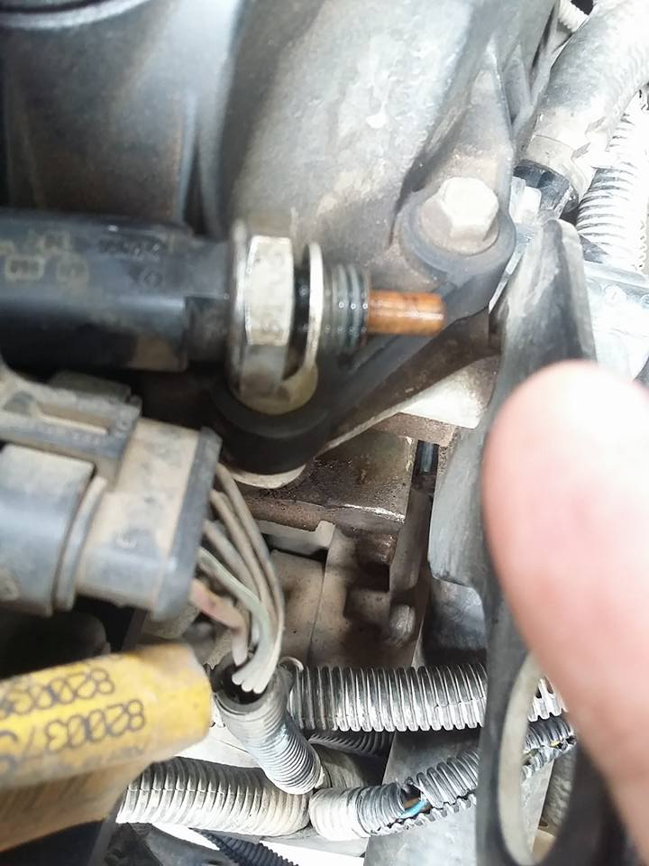
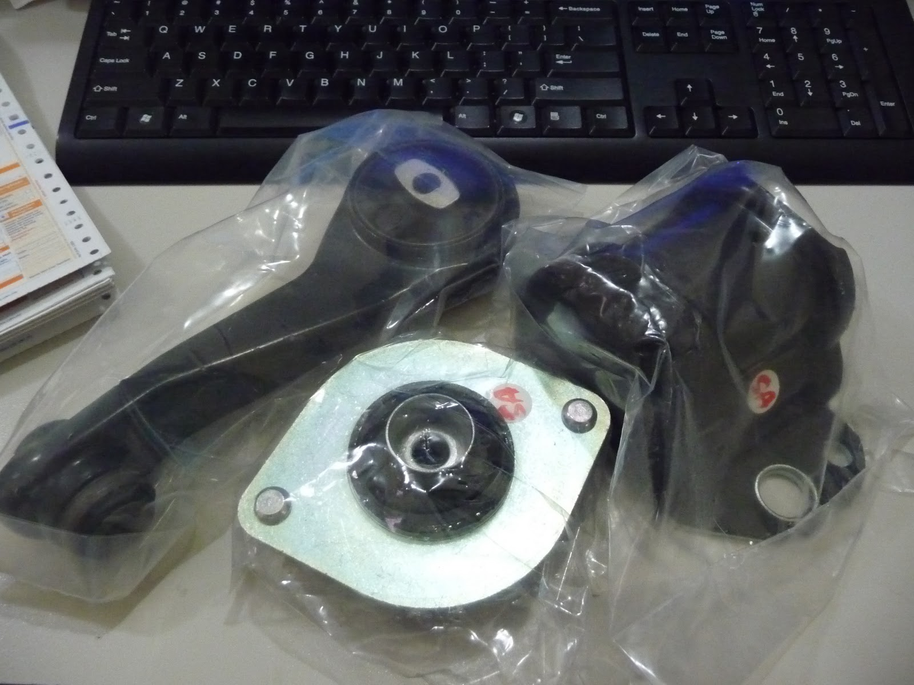
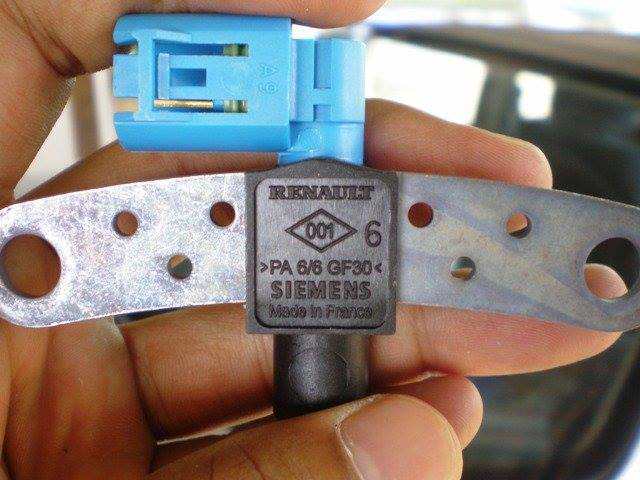
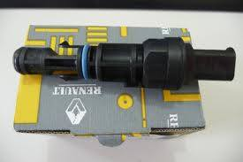

Perawatan Mesin
Spare Part dan Perawatan Mesin

# Perawatan Mesin
## Oli mesin
Engine oli dari manual mensyaratkan SAE 10w-30, best value bisa menggunakan oli TOYOTA 10-40W dengan harga 60 Ribu Saja.
Joe Fajri : MT or AMT utk Oli Mesin yaa standard oli mesin biasa pd umumnya Om....Merk boleh apa aja, Prima XP syntetic, Shell, Total dll dgn kandungan api sae, 10-40, 15-40, 10-30..ingat !!! Savvy AMT adlh bkn Savvy matik full matik sesungguhnya, utk oli transmisi/gearbox ttap memakai oli transmisi biasa pd mbl manual, sperti Pertamina Rored, HDA/HPA sae 90, that's it..!! Very simple....

## Oli Robotic / matic
Ricky Deddy Oetomo : Permisi om2 penunggang savvy... Bagi pengalaman ganti oli maticnya donk? Savvy cocoknya pke oli matic apa selain renaultmatic d3 syn? Terima kasih yg udah mau jawab.. Salam kenal buat semuanya...
Matthew Parrabelium Saya pakai total d3 aman sejahtera sampai sekarang. Oh ya, oli matic nya buat di robotic nya doang loh ya...
Kalau di transmisi nya di isi oli manual, bukan oli matic

Teguh Robotic kalau oli gear box untuk transmisi,,pakai GL 4 aja om,,,kecuali oli metic nya pakai dexstron 3,,,atau XP 3,,

Kalo isi sendiri sampe berapa banyak?

Muhammad IR kebanyakan om, isinya sedikit dari batas minimal omFilter Oli

Muhammad IR itu kn ada kyak garis menonjol om, isi sedikit di atasnya om

Muhammad IR coba deh filter udaranya di buka, biar pandangannya lbh luas

Joe Fajri Batas nya yaa garis/nat yg tengah tangki oli matik itu Om....

Kontak distributor sakura 089698355615.
Generiknya merek sakura, alternatif bagus menggunakan oli filter Honda Jazz dengan karet melebar dan bentuknya sama. Selain itu bisa juga alternatif jika kepepet menggunakan filter oli dari livina, hanya saja livina karet pakingnya lebih tipis dibandingkan Jazz. Harga filter oli jazz 40 Ribu.

Filter Udara

Joe Fajri : Filter udara persamaannya cukup dgn kawat nyamuk yg agak renggang, dibentuk segi 4 trus gulung sesuai ruang box nya, tutup lg deh dan rasakan perbedaanya.

# Busi dan Kabel Busi
Okie Chan : permisi para senior, saya mau curhat sedikit. savvy saya baru2 ini kadang berebet. apa lagi saat sedang nyalakan AC berebetnya makin gede. kira2 apa yah penyebabnya?? mohon pencerahannya. trimakasih.

Herbert Norman Tjandra : Dicabut aj test satu2 posisi mesin hidup kalo dicabut ad strum apinya n nembak ke busi itu normal....dicek deh satu2....
Nandi Hidayat @om Herbert Norman Tjandra, agak hati2 om kalo chek busi..jangan d tempel ke mesin kaya mobil dulu (belum ECU system) saya pernah short ke ECU,so d ganti salah satu potensio n ic nya..diliat aj ada loncatan api g??

# Fanbelt & Tensioner

Herbert Norman Tjandra : Cek sekringnya coba nte... di kap mesin depan sebelah kiri dekat aki ad box wrna hitam... lanjut kalo msh bagus,cek soket fannya dkt kipas cabut n pasang lg takut kotor... kalo msh bgitu yah ga ad obat nte ganti fannya... smoga ga berat sih kasusnya...
Nad Nadiahnad : Rohmat Cah Majasem Yunani motor ga kbakar, cuma tadi air radiator nyusut jd kluar asep
Herbert Norman Tjandra : Fanbelt set 350rb nte n tensioner set 850rb... di toko 74 atrium senen...

Sensor Temperatur Air (Collant Sensor/ Water Temperatur Sensor)
Other Part Number: 7700101968, 7700103348, 7700113867, VE375027, 8200561449,

Problem : Temperaturnya suka tiba2 naik ke 4 trus ga berapa lama turun 3 dan keulang2 kaya gitu terus.. Ada yg tau kenapa ga ya? Makasih..
Solution : tersangkanya fan sudah lemah atau water temperature sensor kotor
Dwi Prasetio : Dibersihin doank...buka pake kunci shock panjang yg buar buka baut roda..ukuran 21...soalnya sebelumnya ane merasa responnya agak telat...jd fannya baru nyala setelah lebih dr 100 derajat...menurut suhu dimari mustinya sebelum 100 atau sekitar 97 derajat dah nyala...
Letak Dekat dengan Thermostat, bersihkan bisa menggunakan amplas
Dwi Prasetio : Diamplas aja..pake amplas alus..hilang kerak2 karatnya....tadi pagi ane tungguin ampe kipas nyala...sepertinya sudah lebih sensitif....jadi gak sampe mendidih air di tank radiator..sudah nyala kipasnya....mudah2an emang itu sebabnya...soalnya radiator jg sdh ane service...motor kipas jg baru ganti..
Dwi Prasetio : Di buka gak keluar kok airnya...thermostat itu yang deket ckp....yang ada pentil buat kuras air radiator....buka dulu tutup filter udara
sumber

## Thermostat

Renault CLIO III KANGOO MODUS TWINGO THALIA WIND - 1.2 THERMOSTAT & HOUSING - NEW
OEM Thermostat RENAULT CLIO 1.2 1.2 16V HI-FLEX 1.2 16V 98-13
HPITH0013 Integrated Thermostat Housing & Seal Clio Kangoo Twingo Savvy Sandero
PROTON SAVVY 1.2 16V D4F 05-11

Renault Clio III 1.2 2005 Onwards Thermostat & Housing
Renault Clio/Kangoo/Modus/Thalia/Twingo or Wind Thermostat 8200660882

Thermostat and Seal.
Renault Part Number: 8200660882
Nissan Part Number: 11061-00QAE
FTK071
RENAULT 7700110716
New and with a 12 month guarantee.
Applications:
Clio Mk 2 and 3
1.1, 1.2
Kangoo
1.2
Modus
1.2, 1.5
Thalia
1.2
Twingo
1.2
Wind
1.2
http://www.ebay.com.sg/itm/Renault-Clio-Kangoo-Modus-Thalia-Twingo-or-Wind-Thermostat-8200660882-/171726702863?hash=item27fbb5890f:g:n9IAAOSw34FVDDEB#shpCntId 271rb
http://www.ebay.co.uk/itm/Renault-Clio-Kangoo-Modus-Thalia-Twingo-or-Wind-Thermostat-8200660882-/171726702863?fits=Car+Make%3ARenault%7CModel%3AWind&hash=item27fbb5890f:g:n9IAAOSw34FVDDEB 267rb
http://www.ebay.co.uk/itm/281009978933#vi-ilComp 300rb
https://infopart.org/renault-1106100qae-part
https://infopart.org/nissan-1106100qae-part
https://infopart.org/first-line-ftk071-part
http://www.ecsenang.com/goods.php?id=2318

# Engine Mounting

Jika getaran mesin terasa di kabin, maka saatnya ganti engine mounting. Ada 3 buat engine mounting diatas, samping gearbox dan bawah

Rear Gearbox
Rear Gearbox Engine Mounting Renault Clio II Kangoo1.4 1.6 8200155207 8200175102
NEW RENAULT CLIO 1.2 16V 99>05 REAR GEARBOX ENGINE MOUNT 8200155207
REAR ENGINE MOUNTING MOUNT RENAULT CLIO,KANGOO,KANGOO EXPRESS, 8200155207

Left Front/Transmission Mounting

# CKP

Problem : Tarikan bawah lemot, ga kuat nanjak

Solution : Modif CKP, langsung dorong aja ke bengkel GT Joe

Speed Sensor

